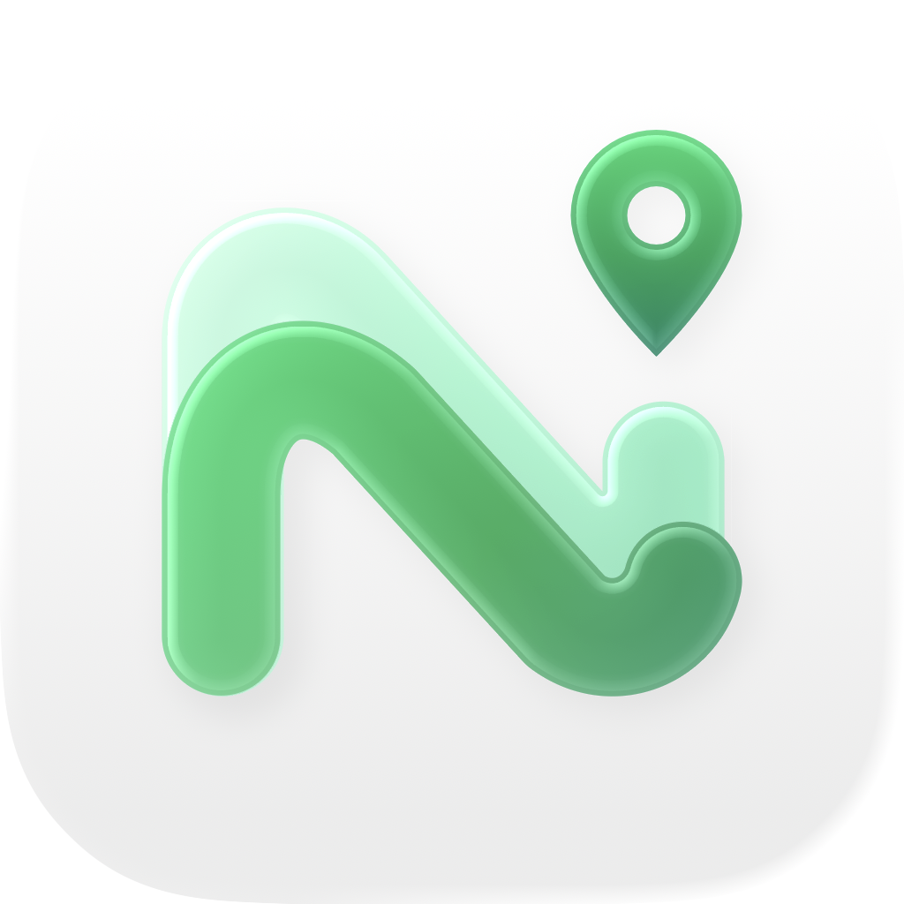

# NapNav (StopAlarm) 🧭💤

<div align="center">
  

  <h3>แอปเตือนใกล้จุดหมาย สำหรับวันที่อยากพักสายตาระหว่างทาง</h3>

  <p>
    <a href="LICENSE"></a>
    
    
  </p>
</div>

---

## 📖 เกี่ยวกับ NapNav

**NapNav** เป็นแอปเตือนใกล้จุดหมายสำหรับ iPhone เลือกสถานที่บนแผนที่หรือค้นหาผ่าน MapKit กำหนดระยะที่อยากให้เตือน แล้วเริ่มทริปได้จากหน้าหลัก เหมาะกับการเดินทางที่อยากพักสายตา แต่ยังต้องรู้ตัวก่อนถึงปลายทาง

ระหว่างทริป แอปใช้ตำแหน่งของอุปกรณ์ตรวจระยะห่างจากจุดหมาย หากเปิด Live Activities ไว้ สถานะทริปจะแสดงบนหน้าจอล็อกและ Dynamic Island ของอุปกรณ์ที่รองรับ การเตือนใช้ Notification, AlarmKit หรือทั้งสองแบบตามโหมดที่เลือกและสิทธิ์ที่มี หากไม่มีช่องทางส่งการเตือน แอปจะเปิดหน้าตั้งค่าการเตือนและไม่เริ่มทริป

> **สถานะการตรวจสอบ:** ผล build และ Simulator ใน [รายงานการพัฒนา](docs/DEVELOPMENT_REPORT.md) ผูกกับ source แต่ละช่วง ส่วนเสียง, Silent/Focus, หน้าจอล็อก และการทำงานเบื้องหลังบน iPhone จริงยังอยู่ใน [device gate](docs/NAPNAV_REMEDIATION_PLAN.md)

---

## ✨ คุณสมบัติเด่น

- 📍 **เตือนตามระยะจากจุดหมาย**
  - เลือกระยะ 500 เมตร, 1 หรือ 2 กิโลเมตร หรือกำหนดเองในช่วง 100–5,000 เมตร
  - กรองตำแหน่งที่เก่าหรือคลาดเคลื่อนมาก และรอให้อยู่ในเขตสองตัวอย่างติดต่อกันก่อนสั่งเตือน
- 🏝️ **Live Activities และ Dynamic Island**
  - แสดงชื่อจุดหมาย ระยะที่เหลือ และสถานะทริปเมื่อระบบอนุญาตให้ใช้ Live Activities
  - ข้อมูลอัปเดตตามตำแหน่งที่ iOS ส่งให้และเงื่อนไขของแอป ไม่ได้อัปเดตทุกวินาทีเสมอไป
- 🔔 **ช่องทางการเตือน**
  - เลือก Notification, AlarmKit บน iOS 26 ขึ้นไป หรือทั้งสองแบบ
  - แอปตรวจสิทธิ์และช่องทางที่ใช้ได้ก่อนเริ่มทริป เมื่อไม่มีช่องทางเตือน จะพาไปหน้าตั้งค่าการเตือน
- 🗺️ **ค้นหาและบันทึกจุดหมาย**
  - ค้นหาสถานที่ผ่าน MapKit หรือเลือกจุดหมายบนแผนที่
  - บันทึกสถานที่โปรดและเรียกจุดหมายที่ใช้ล่าสุดได้
- 🌐 **ภาษาไทยและอังกฤษ**
  - ใช้ภาษาตามระบบหรือเลือกเองในแอป
- ♿ **การช่วยการเข้าถึง**
  - มีป้ายกำกับและสถานะสำหรับ VoiceOver พร้อมการปรับหน้าจอบางส่วนสำหรับ Dynamic Type และ Reduce Motion
  - งานตรวจการใช้งานจริงด้วย VoiceOver และขนาดตัวอักษรต่าง ๆ ยังอยู่ในแผน A3

NapNav ใช้ตำแหน่งของอุปกรณ์ ไม่ได้ใช้ตารางเวลาหรือข้อมูลเส้นทางขนส่งสาธารณะ เวลาและความแม่นยำของการเตือนขึ้นอยู่กับตำแหน่งที่ iOS ส่งให้ สิทธิ์ที่ได้รับ และสภาพการทำงานของเครื่อง

---

## 🛠️ สถาปัตยกรรมและเทคโนโลยี

แอปเขียนด้วย SwiftUI โดยให้ `TripStore` จัดการสถานะทริป และแยกบริการของระบบออกเป็น client เพื่อทดสอบตรรกะด้วย mock ได้

- **หน้าจอและสถานะ:** SwiftUI, Observation, `TripStore`
- **ตำแหน่งและค้นหาสถานที่:** Core Location, MapKit
- **การเตือน:** UserNotifications, AlarmKit เมื่อระบบรองรับ
- **สถานะบนหน้าจอล็อก:** ActivityKit, WidgetKit
- **ข้อมูลในเครื่อง:** `UserDefaultsTripPersistence`
- **การทดสอบ:** Swift Testing และเส้นทาง GPX

```text
NapNav/
├── StopAlarm/           # แอปและตรรกะทริป
├── NapNavWidget/        # Live Activity และ Dynamic Island
├── StopAlarmTests/      # ชุดทดสอบอัตโนมัติ
├── TestRoutes/          # เส้นทาง GPX
└── docs/                # แผนและรายงานการพัฒนา
```

---

## 🚀 วิธีติดตั้งและรันโปรเจกต์

### ความต้องการของระบบ

- Mac ที่ติดตั้ง Xcode รุ่นซึ่งรองรับ Swift 6 และ iOS 18 SDK
- iPhone หรือ iPhone Simulator ที่ใช้ iOS 18 ขึ้นไป

### ขั้นตอนการรัน

1. **ดาวน์โหลดโปรเจกต์**

   ```bash
   git clone https://github.com/Telnwza/NapNav.git
   cd NapNav
   ```

2. **เปิดใน Xcode**

   ```bash
   open StopAlarm.xcodeproj
   ```

3. **เลือก scheme `StopAlarm` และอุปกรณ์** แล้วกด Run (`⌘R`) หากรันบน iPhone ให้ตั้ง Team และ Bundle Identifier ของแอปกับ widget ให้ตรงกับบัญชีนักพัฒนาที่ใช้

---

## 🧪 การทดสอบ

กด Test (`⌘U`) ใน Xcode เพื่อรันชุดทดสอบอัตโนมัติ ดูคำสั่ง ผล และ source snapshot ของรอบที่เคยทดสอบใน [Development Report](docs/DEVELOPMENT_REPORT.md)

### จำลองการเดินทางด้วย GPX

ใน [`TestRoutes/`](TestRoutes/README.md) มีสามเส้นทาง:

1. `approach-destination.gpx` — เข้าใกล้จุดหมาย
2. `pass-outside.gpx` — ผ่านนอกเขตเตือน
3. `gps-jump.gpx` — ตำแหน่งกระโดดเข้าเขตเพียงตัวอย่างเดียว

วิธีเลือก GPX ใน Xcode อยู่ใน README ของโฟลเดอร์นั้น เส้นทางเหล่านี้มีการใช้ในชุดทดสอบ GPX ด้วย ผล Simulator ไม่ยืนยันเสียงหรือพฤติกรรมขณะล็อกจอบน iPhone จริง

---

## 🤝 การมีส่วนร่วม

พบปัญหาหรืออยากเสนอการเปลี่ยนแปลง เปิด issue หรือ pull request พร้อมขั้นตอนทำซ้ำและผลที่คาดหวังได้ ก่อนแก้โค้ด โปรดอ่าน [ข้อตกลงการทำงาน](AGENTS.md) และ [แผนปัจจุบัน](docs/NAPNAV_REMEDIATION_PLAN.md)

---

## ☕ สนับสนุนผู้พัฒนา

หากอยากสนับสนุนโครงการ สามารถ [ซื้อกาแฟให้ผู้พัฒนา](https://buymeacoffee.com/techin)

<div align="center">
  <a href="https://buymeacoffee.com/techin">
    
  </a>
</div>

---

## 📄 ใบอนุญาต

โปรเจกต์มีไฟล์ [GNU General Public License v3.0](LICENSE) สำหรับรายละเอียดข้อกำหนดการใช้งาน

---

<div align="center">
  พักได้ระหว่างทาง และอย่าลืมตรวจว่าการเตือนบนเครื่องของคุณพร้อมใช้งานก่อนออกเดินทาง 🧭
</div>
